# BerTele2 Architecture

This document describes the complete architecture of BerTele2. It is the authoritative reference for how subsystems fit together.

## Overview

BerTele2 is a **self-hosted Telegram MTProto gateway**. It exposes Telegram capabilities through a unified REST + WebSocket API, processes media through a pluggable pipeline, and connects to external automation platforms via connectors and plugins.

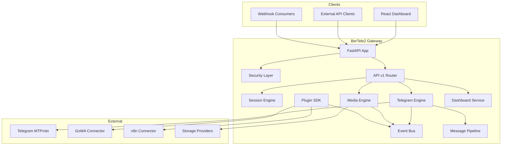

## Session Engine

Manages Telegram session lifecycle: create, connect, disconnect, reconnect, delete. Uses a repository for persistence, a cache for fast access, and a pool of Telethon clients.

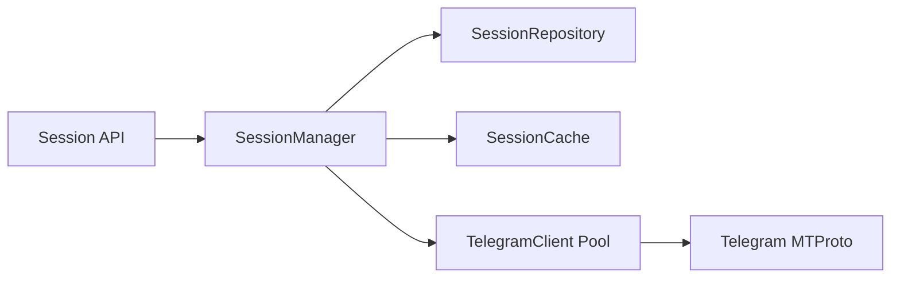

See [context/core.md](context/core.md) and [context/telegram.md](context/telegram.md).

## Telegram Engine

Wraps Telethon to provide dialogs, messages, entity resolution, and media download. It owns the client pool and the message pipeline.

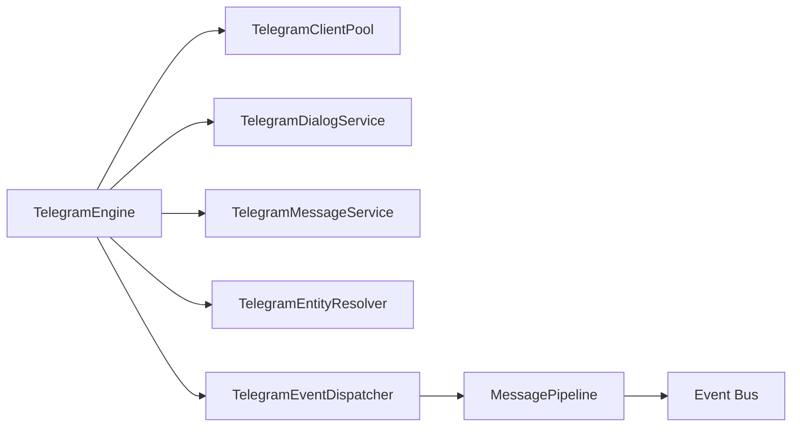

See [context/telegram.md](context/telegram.md).

## GoWA Connector

Connects BerTele2 to GoWA (WhatsApp gateway) for sending media. Includes a config, sender, mapper, and service layer.

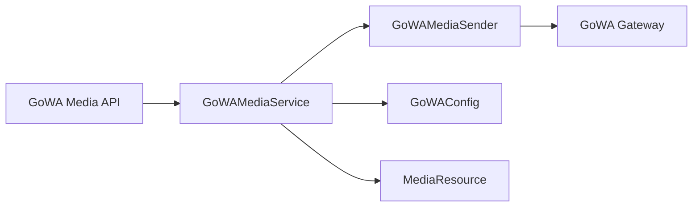

See [context/gowa.md](context/gowa.md).

## Media Engine

Handles media resources: models, storage providers, and the media pipeline.

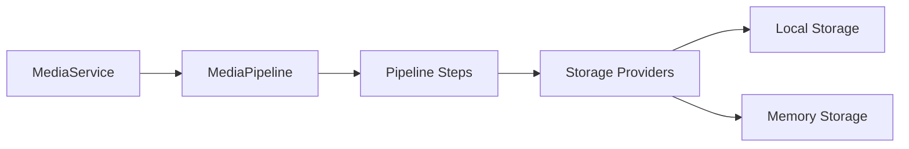

See [context/media.md](context/media.md) and [context/storage.md](context/storage.md).

## Media Pipeline

A pluggable pipeline that processes media through ordered steps: validation, hashing, MIME detection, metadata extraction, and storage.

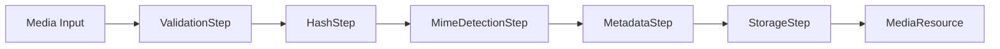

See [context/media.md](context/media.md).

## Storage Providers

Pluggable storage backends behind a common `StorageProvider` interface. Currently: local filesystem and in-memory.

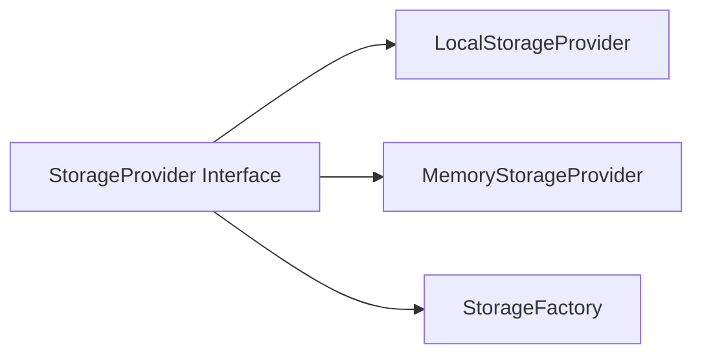

See [context/storage.md](context/storage.md).

## Event Bus

An in-process event bus with publisher, dispatcher, registry, and queue. Subsystems communicate by publishing and subscribing to typed events.

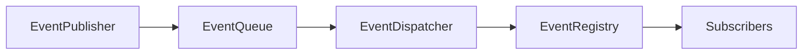

See [context/eventbus.md](context/eventbus.md).

## Automation Engine

Planned subsystem for workflow automation (triggers, actions, conditions, scheduler). Not yet implemented; documented as an extension point.

See [context/automation.md](context/automation.md).

## Plugin SDK

Allows third-party connectors and automations via a stable plugin interface: `PluginBase`, `PluginManifest`, `PluginManager`, and hook registry.

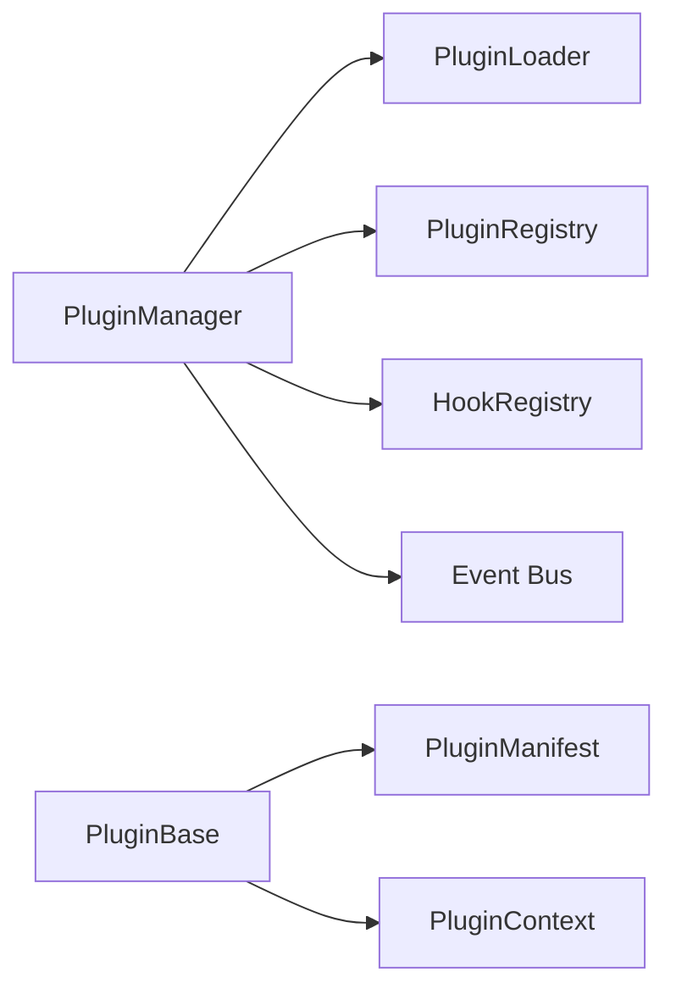

See [context/plugins.md](context/plugins.md).

## Dashboard

Provides overview, logs, and metrics via REST endpoints and a WebSocket for real-time updates. Frontend is a React + TypeScript app.

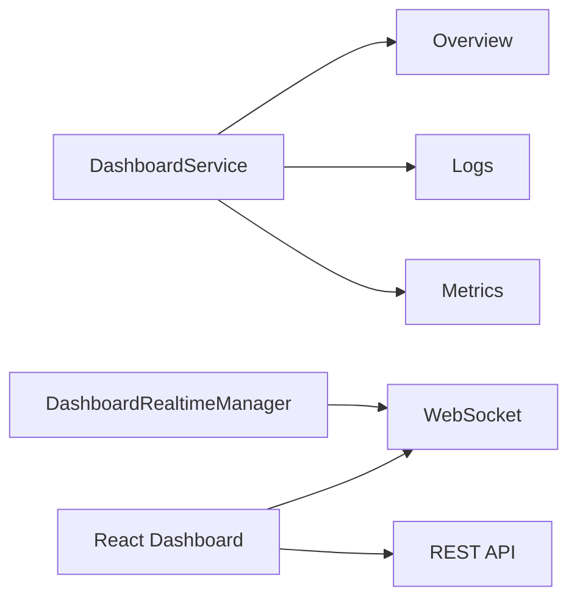

See [context/dashboard.md](context/dashboard.md).

## Connector Architecture

Connectors (GoWA, n8n) are plugins that bridge BerTele2 to external services. They expose REST endpoints and subscribe to events.

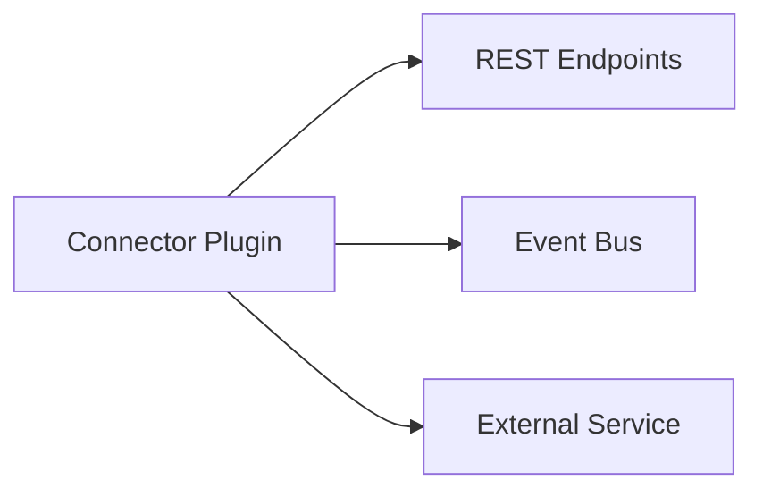

See [context/plugins.md](context/plugins.md) and [context/gowa.md](context/gowa.md).

## Dependency Injection

Dependencies are wired explicitly via a container (`app/core/container.py`) and constructor injection. Services receive their dependencies as constructor arguments; no global singletons.

See [context/core.md](context/core.md) and [decisions/ADR-0006-dependency-injection.md](decisions/ADR-0006-dependency-injection.md).

## Configuration

Configuration uses Pydantic Settings with a `BERTELE2_` environment prefix. Each subsystem (GoWA, n8n, Telegram) has its own settings class.

See [context/core.md](context/core.md).

## Future Extensions

- **Automation Engine**: workflow triggers, actions, conditions, scheduler.
- **More Storage Providers**: S3, GCS, Azure Blob.
- **More Connectors**: additional messaging platforms.
- **Worker Pool**: background task processing.
- **Multi-tenant**: per-tenant isolation.

See [roadmap.md](roadmap.md).

---

## Related Documents

- [project.md](project.md) — Vision and goals.
- [module-map.md](module-map.md) — Module-level details.
- [context/](context/) — Per-subsystem deep dives.
- [decisions/](decisions/) — Architecture Decision Records.