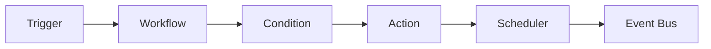

# Context: Automation

This document describes the automation subsystem of BerTele2.

## Purpose

The automation subsystem (planned) will provide workflow automation: triggers, actions, conditions, and scheduling. It is not yet implemented; this document defines the intended design and extension points.

## Architecture (Planned)

## Main Components (Planned)

- **`Trigger`** — Detects an event that starts a workflow.
- **`Workflow`** — A defined sequence of steps.
- **`Condition`** — Gates whether a step runs.
- **`Action`** — Executes a step (send message, call webhook, etc.).
- **`Scheduler`** — Runs workflows on a schedule.
- **`Executor`** — Executes workflow steps.
- **`Registry`** — Registers triggers, actions, and conditions.

## Dependencies (Planned)

- `app.events` (event bus)
- `app.telegram` (message actions)
- `app.integrations` (webhook actions)

## Extension Points

- Register new triggers, actions, and conditions.
- Add scheduling backends.
- Add workflow persistence.

## Known Limitations

- Not yet implemented.

## Future Roadmap

- Workflow engine.
- Scheduler.
- Workflow persistence and versioning.
- Audit and metrics.

---

## Related Documents

- [architecture.md](../architecture.md) — System architecture.
- [eventbus.md](eventbus.md) — Event bus.
- [roadmap.md](../roadmap.md) — Future epics.
- [glossary.md](../glossary.md) — Automation and workflow terms.