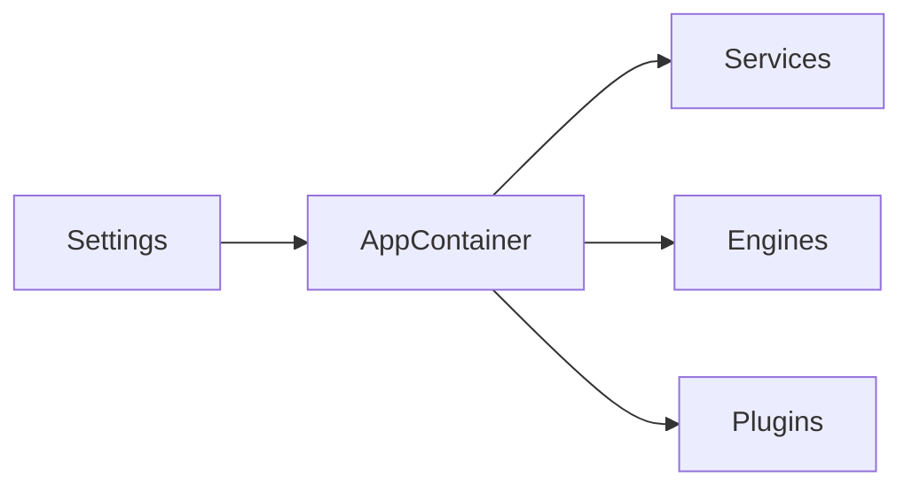

# Context: Core

This document describes the core subsystem of BerTele2.

## Purpose

The core subsystem provides configuration, dependency injection, and shared utilities used across the application.

## Architecture

## Main Components

- **`Settings`** — Pydantic settings with `BERTELE2_` environment prefix.
- **`get_settings`** — Accessor for the settings singleton.
- **`AppContainer`** — Composition root that wires dependencies.
- **`app/utils`** — Shared utility functions.

## Dependencies

- Pydantic
- pydantic-settings
- SQLAlchemy (via models)

## Extension Points

- Add new settings classes for new subsystems.
- Register new services in the container.

## Known Limitations

- Settings are loaded at startup; no hot reload.
- In-memory user store in security (see [security.md](security.md)).

## Future Roadmap

- Centralized logging configuration.
- Environment-specific settings profiles.
- Health check integration.

---

## Related Documents

- [architecture.md](../architecture.md) — System architecture.
- [module-map.md](../module-map.md) — Module details.
- [decisions/ADR-0006-dependency-injection.md](../decisions/ADR-0006-dependency-injection.md) — DI decision.