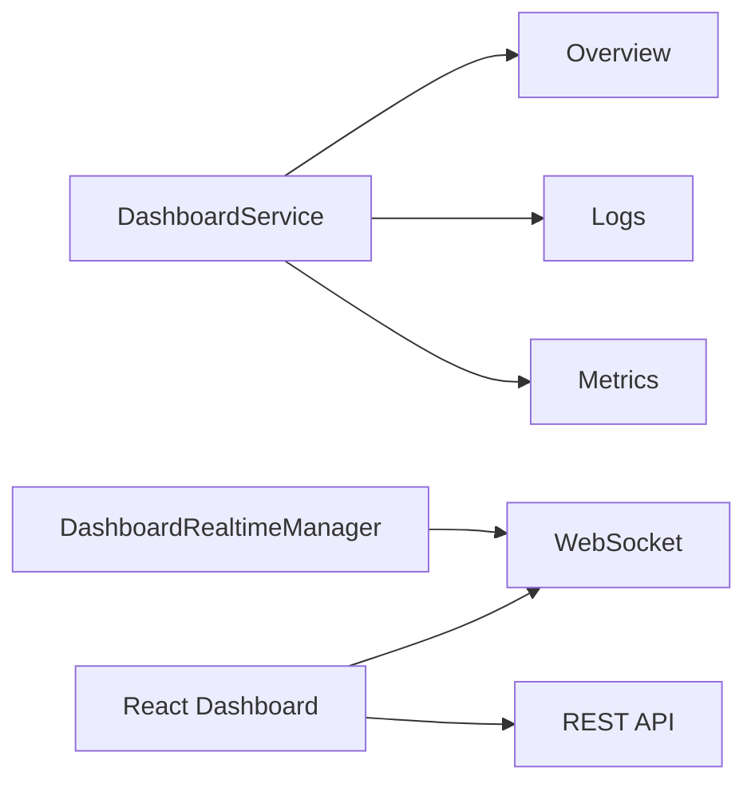

# Context: Dashboard

This document describes the dashboard subsystem of BerTele2.

## Purpose

The dashboard provides overview, logs, and metrics via REST endpoints and a WebSocket for real-time updates. The frontend is a React + TypeScript app.

## Architecture

## Main Components

- **`DashboardService`** — Provides overview, logs, and metrics data.
- **`DashboardRealtimeManager`** — Manages WebSocket connections and broadcasts.
- **`router`** — REST endpoints (`/dashboard/overview`, `/dashboard/logs`, `/dashboard/metrics`, `/dashboard/ws`).
- **React frontend** — `dashboard/` directory (Vite + TypeScript).

## Dependencies

- `app.security` (authentication for REST endpoints and WebSocket).

## Extension Points

- Add new dashboard sections.
- Add real-time event broadcasting.
- Add real metrics collection.

## Known Limitations

- Metrics are currently stubbed (not real data).
- WebSocket is single-process.

## Future Roadmap

- Real metrics data.
- Real-time charts.
- Multi-process WebSocket support.

---

## Related Documents

- [architecture.md](../architecture.md) — System architecture.
- [security.md](security.md) — Authentication.
- [module-map.md](../module-map.md) — Module details.