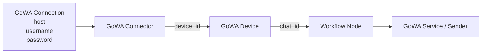

# Context: GoWA

This document describes the GoWA connector subsystem of BerTele2.

## Purpose

The GoWA connector bridges BerTele2 to GoWA (a WhatsApp gateway) for sending media to WhatsApp recipients.

## Architecture

### Authentication Model

Authentication is handled at the **GoWA Connection** level.

Each connection consists of:

- **host** — GoWA gateway host/URL.
- **username** — GoWA API username.
- **password** — GoWA API password.

These credentials **MUST NOT** be stored inside workflow nodes. They are managed exclusively by the Connector and injected at runtime.

### Device Model

Each WhatsApp device is identified by:

- **device_id**

One GoWA connection may manage one or more devices if supported by the connector.

### Node Model

Workflow nodes may contain **ONLY**:

- **device_id**
- **chat_id**

Nodes **MUST NEVER** contain:

- host
- username
- password
- authentication tokens

## Main Components

- **`GoWAConfig`** — Configuration for the GoWA connector (base URL, API key, timeouts, retries).
- **`GoWAMediaService`** — Service layer that validates config and invokes the sender.
- **`GoWAMediaSender`** — Sends media to the GoWA gateway.
- **`GoWAMediaMapper`** — Maps media resources to GoWA payloads.
- **`GoWAMediaError`** — Base exception for GoWA media errors.
- **`GoWAMediaSendError`** — Raised when sending fails.
- **`GoWAUnsupportedMedia`** — Raised for unsupported media types.
- **`GoWAValidationError`** — Raised for invalid configuration or input.

## Dependencies

- `app.media` (MediaResource)
- `plugins.gowa.config` (GoWAConfig)

## Extension Points

- Add new media types supported by GoWA.
- Add receive-media capabilities.

## Known Limitations

- Send-only currently.
- Mock transport available for development.

## Future Roadmap

- Receive media from GoWA.
- Delivery status webhooks.
- More media types.

---

## Related Documents

- [architecture.md](../architecture.md) — System architecture.
- [media.md](media.md) — Media resources.
- [plugins.md](plugins.md) — Plugin SDK.
- [decisions/ADR-0002-plugin-architecture.md](../decisions/ADR-0002-plugin-architecture.md) — Plugin decision.
- [../development-rules.md](../development-rules.md) — Mandatory development rules.
- [../AI_MANIFEST.md](../AI_MANIFEST.md) — AI SDK manifest.
- [../SYSTEM_PROMPT.md](../SYSTEM_PROMPT.md) — System prompt for AI agents.
- [../AI_CHANGELOG.md](../AI_CHANGELOG.md) — AI SDK changelog.