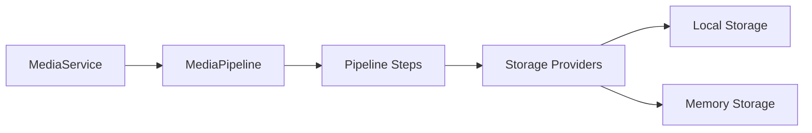

# Context: Media

This document describes the media subsystem of BerTele2.

## Purpose

The media subsystem handles media resources: models, storage providers, and the media pipeline.

## Architecture

## Main Components

- **`MediaService`** — Entry point for media operations.
- **`MediaResource`** — Unit of media (metadata, storage key, content).
- **`MediaPipeline`** — Executes ordered processing steps.
- **`MediaPipelineBuilder`** — Builds pipelines with configured steps.
- **`MediaPipelineStep`** — Interface for pipeline steps.
- **`PipelineRegistry`** — Registers and looks up steps.
- **`MediaMetadata`** — Metadata model for media.

## Pipeline Steps

- **`ValidationStep`** — Validates the media input.
- **`HashStep`** — Computes a content hash.
- **`MimeDetectionStep`** — Detects the MIME type.
- **`MetadataStep`** — Extracts metadata.
- **`StorageStep`** — Stores the media via a provider.

## Dependencies

- None (self-contained).

## Extension Points

- Add new pipeline steps by implementing `MediaPipelineStep`.
- Add new storage providers (see [storage.md](storage.md)).
- Register custom steps in the `PipelineRegistry`.

## Known Limitations

- Only local and memory storage providers currently.
- No streaming for very large files.

## Future Roadmap

- S3/GCS storage providers.
- Thumbnail generation.
- Transcoding support.

---

## Related Documents

- [architecture.md](../architecture.md) — System architecture.
- [storage.md](storage.md) — Storage providers.
- [telegram.md](telegram.md) — Telegram media download.
- [gowa.md](gowa.md) — GoWA media send.
- [decisions/ADR-0003-media-pipeline.md](../decisions/ADR-0003-media-pipeline.md) — Pipeline decision.
- [decisions/ADR-0004-storage-provider.md](../decisions/ADR-0004-storage-provider.md) — Storage decision.