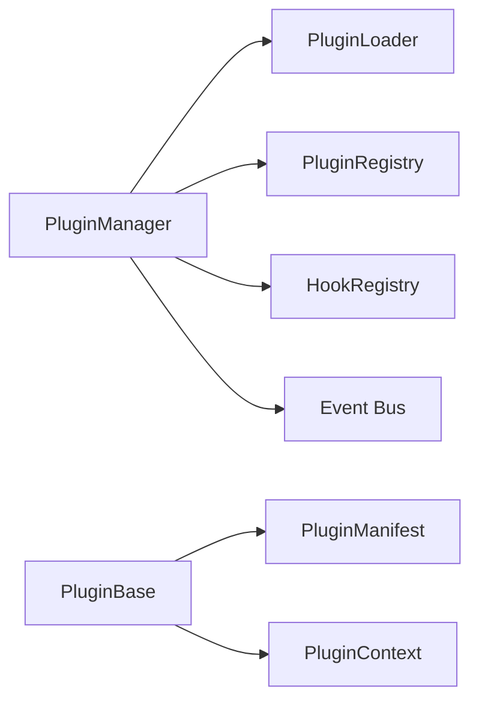
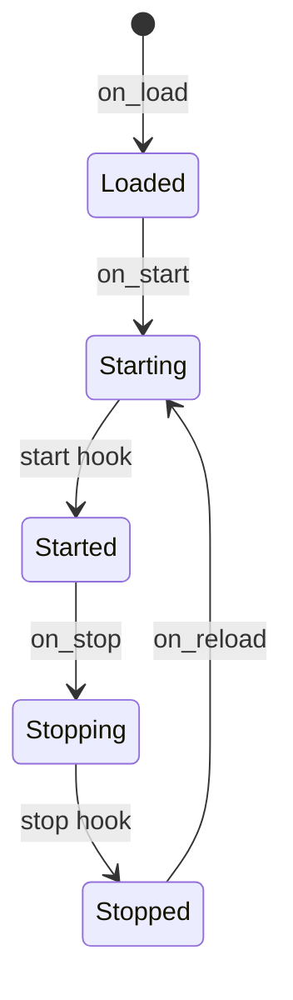

# Context: Plugins

This document describes the plugin subsystem of BerTele2.

## Purpose

The plugin subsystem provides a Plugin SDK that allows third-party connectors and automations to extend BerTele2.

## Architecture

## Main Components

- **`PluginBase`** — Base class for plugins (lifecycle, manifest, context).
- **`PluginManifest`** — Plugin metadata (id, name, version, compatibility).
- **`PluginContext`** — Runtime context for a plugin (config, logger, event access).
- **`PluginManager`** — Loads, starts, stops, and reloads plugins.
- **`PluginLoader`** — Loads plugins from paths.
- **`PluginRegistry`** — Registers and looks up plugins.
- **`HookRegistry`** — Registers and dispatches hooks.
- **`PluginLifecycle`** — Manages plugin state transitions.

## Plugin Lifecycle

## Dependencies

- `app.events` (event bus)

## Extension Points

- Create new plugins by subclassing `PluginBase`.
- Register hooks in the `HookRegistry`.
- Subscribe to events via the plugin context.

## Known Limitations

- Plugins are loaded from local paths.
- No plugin marketplace yet.

## Future Roadmap

- Plugin marketplace.
- Remote plugin loading.
- Plugin sandboxing.

---

## Related Documents

- [architecture.md](../architecture.md) — System architecture.
- [eventbus.md](eventbus.md) — Event bus.
- [gowa.md](gowa.md) — GoWA connector plugin.
- [decisions/ADR-0002-plugin-architecture.md](../decisions/ADR-0002-plugin-architecture.md) — Plugin decision.