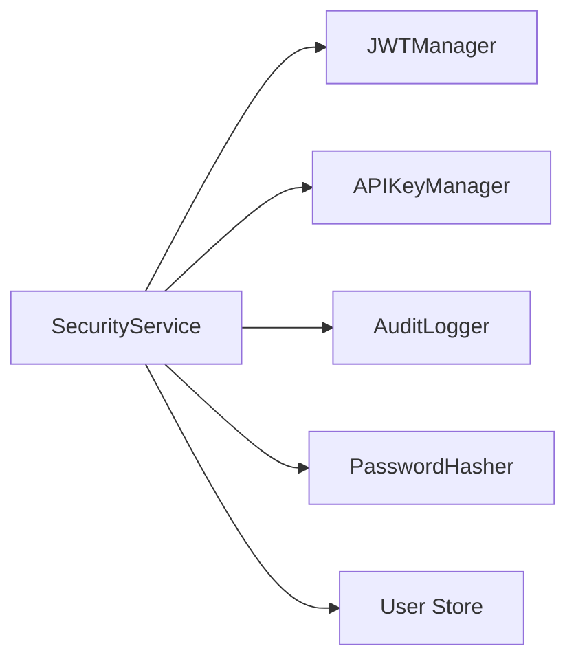

# Context: Security

This document describes the security subsystem of BerTele2.

## Purpose

The security subsystem provides authentication, authorization, API key management, and audit logging.

## Architecture

## Main Components

- **`SecurityService`** — Facade for authentication and authorization.
- **`UserRecord`** — User model (roles, permissions, active state).
- **`JWTManager`** — Encodes/decodes JWT access and refresh tokens.
- **`APIKeyManager`** — Creates, lists, and revokes API keys.
- **`PasswordHasher`** — Hashes and verifies passwords.
- **`AuditLogger`** — Logs security events.
- **`require_authentication`** — FastAPI dependency for auth.
- **`require_permissions`** — FastAPI dependency for permission checks.

## Authentication Methods

- **JWT Bearer** — Access and refresh tokens.
- **API Key** — `x-api-key` header.

## Roles and Permissions

- **admin** — Full access.
- **api_writer** — API key management.
- **auditor** — Audit read access.
- **user** — Basic read access.

## Dependencies

- JWT
- Password hashing

## Extension Points

- Add new roles and permissions.
- Add OAuth2 or other auth providers.
- Add persistent user store.

## Known Limitations

- User store is in-memory (not persistent).
- No refresh token rotation yet.

## Future Roadmap

- Persistent user store.
- Refresh token rotation.
- OAuth2 support.
- Rate limiting.

---

## Related Documents

- [architecture.md](../architecture.md) — System architecture.
- [dashboard.md](dashboard.md) — Dashboard authentication.
- [core.md](core.md) — Settings.
- [module-map.md](../module-map.md) — Module details.