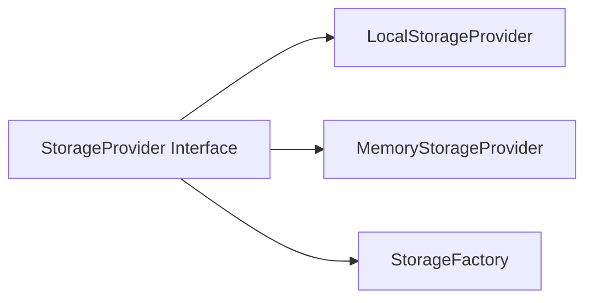

# Context: Storage

This document describes the storage subsystem of BerTele2.

## Purpose

The storage subsystem provides pluggable storage backends for media resources behind a common `StorageProvider` interface.

## Architecture

## Main Components

- **`StorageProvider`** — Interface for storage backends.
- **`LocalStorageProvider`** — Stores media on the local filesystem.
- **`MemoryStorageProvider`** — Stores media in memory (for testing/dev).
- **`StorageFactory`** — Creates storage providers based on configuration.

## Dependencies

- None (self-contained).

## Extension Points

- Add new storage providers by implementing `StorageProvider`.
- Register providers in the `StorageFactory`.

## Known Limitations

- Only local and memory providers currently.
- No cloud storage.

## Future Roadmap

- S3 provider.
- GCS provider.
- Azure Blob provider.
- Streaming uploads.

---

## Related Documents

- [architecture.md](../architecture.md) — System architecture.
- [media.md](media.md) — Media pipeline.
- [decisions/ADR-0004-storage-provider.md](../decisions/ADR-0004-storage-provider.md) — Storage decision.