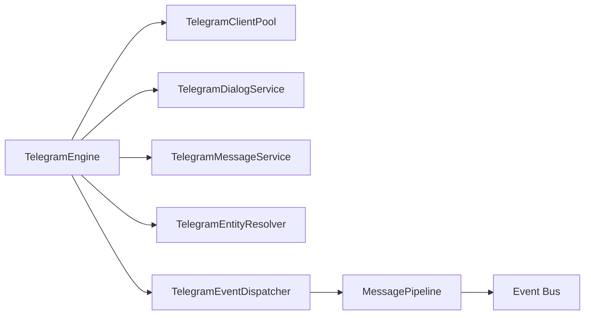

# Context: Telegram

This document describes the Telegram subsystem of BerTele2.

## Purpose

The Telegram subsystem wraps Telethon to provide dialogs, messages, entity resolution, media download, and event dispatch.

## Architecture

## Main Components

- **`TelegramEngine`** — Top-level engine that wires the subsystem.
- **`TelegramClientPool`** — Pool of Telethon clients.
- **`TelegramSessionRegistry`** — Registry of Telegram sessions.
- **`TelegramDialogService`** — Lists and retrieves dialogs.
- **`TelegramMessageService`** — Lists, sends, and forwards messages.
- **`TelegramEntityResolver`** — Resolves Telegram entities.
- **`TelegramEventDispatcher`** — Dispatches incoming updates to the pipeline.
- **`TelegramMediaService`** — Downloads media via the media engine.

## Message Pipeline

Incoming updates flow through the `MessagePipeline`:

- Middleware runs before and after handlers.
- Handlers match updates via predicates.
- Events are published to the event bus.

## Dependencies

- Telethon
- `app.pipeline` (message pipeline)
- `app.events` (event bus)
- `app.media` (media download)

## Extension Points

- Register new pipeline handlers with predicates.
- Add new middleware.
- Add new media types.

## Known Limitations

- Single-process event dispatch.
- No multi-tenant isolation yet.

## Future Roadmap

- Multi-tenant sessions.
- More media types.
- Message editing/deletion events.

---

## Related Documents

- [architecture.md](../architecture.md) — System architecture.
- [media.md](media.md) — Media download.
- [eventbus.md](eventbus.md) — Event bus.
- [core.md](core.md) — Session engine.
- [decisions/ADR-0005-event-driven.md](../decisions/ADR-0005-event-driven.md) — Event-driven decision.