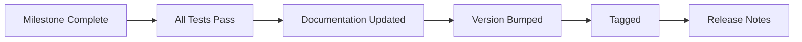

# BerTele2 Release Process

This document defines the release process for BerTele2.

## Versioning

Follow **Semantic Versioning** (MAJOR.MINOR.PATCH):

- **MAJOR** — breaking changes.
- **MINOR** — backward-compatible features.
- **PATCH** — backward-compatible bug fixes.

See [git-workflow.md](git-workflow.md) for versioning conventions.

## Milestones

Releases are tied to milestones defined in [roadmap.md](roadmap.md). Each milestone groups one or more Epics.

## Release Checklist

- [ ] All Epics in the milestone are complete.
- [ ] All tests pass (`pytest`).
- [ ] Coverage expectations are met.
- [ ] Documentation (including AI SDK) is updated.
- [ ] CHANGELOG.md is updated.
- [ ] Version is bumped in `pyproject.toml`.
- [ ] Migration scripts are generated and reviewed.
- [ ] Release branch is created and tagged.
- [ ] Release notes are written.

## Rollback

- Keep the previous release tag available.
- If a release is broken, revert to the previous tag.
- Document the rollback reason in the CHANGELOG.

## Release Flow

---

## Related Documents

- [roadmap.md](roadmap.md) — Milestones and epics.
- [git-workflow.md](git-workflow.md) — Versioning and branching.
- [workflow.md](workflow.md) — Development workflow.