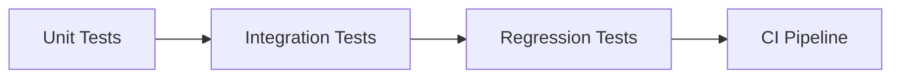

# BerTele2 Testing Strategy

This document defines the testing strategy for BerTele2.

## Overview



## Unit Tests

- Test individual functions, classes, and services in isolation.
- Mock external dependencies (Telethon, HTTP, storage).
- Fast and deterministic.
- Located under `tests/<subsystem>/`.

## Integration Tests

- Test interactions between subsystems (e.g., pipeline + event bus).
- Use real in-memory implementations where possible.
- Verify end-to-end behavior.

## Regression Tests

- Re-run the full suite on every change.
- Add a regression test for every bug fix.
- Ensure previously fixed issues do not reappear.

## Mocking

- Use `unittest.mock` or `pytest-mock`.
- Mock at the **boundary** (external I/O), not internal logic.
- Prefer dependency injection over monkeypatching.

## Coverage Expectations

- Aim for **high coverage** of public behavior.
- Cover error paths and edge cases.
- Use `pytest --cov` to measure coverage.
- New code should not reduce overall coverage.

## Running Tests

```bash
pytest
```

Run a single subsystem:

```bash
pytest tests/media
```

## Test Conventions

- Name test files `test_<module>.py`.
- Name test functions `test_<behavior>`.
- Use fixtures for shared setup.
- Keep tests independent and isolated.

See [coding-standards.md](coding-standards.md) for testing conventions.

---

## Related Documents

- [coding-standards.md](coding-standards.md) — Testing conventions.
- [review-checklist.md](review-checklist.md) — Review checklist.
- [workflow.md](workflow.md) — Development workflow.