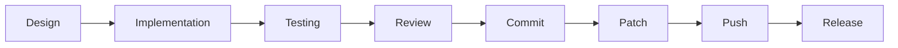

# BerTele2 Development Workflow

This document describes the end-to-end development workflow for BerTele2.

## Overview



## 1. Design

- Read [project.md](project.md), [architecture.md](architecture.md), and [roadmap.md](roadmap.md).
- Define the Epic scope using [epic-template.md](epic-template.md).
- Identify affected modules in [module-map.md](module-map.md).
- Consider whether an ADR is needed for significant decisions.

## 2. Implementation

- Follow [development-rules.md](development-rules.md) and [coding-standards.md](coding-standards.md).
- Implement one focused change at a time.
- Use dependency injection and interfaces.
- Keep modules independent.

## 3. Testing

- Write unit tests for new behavior. See [testing.md](testing.md).
- Run the full test suite before finishing.
- Ensure coverage expectations are met.

## 4. Review

- Self-review against [review-checklist.md](review-checklist.md).
- Verify no unrelated refactoring.
- Confirm documentation is updated.

## 5. Commit

- Follow [git-workflow.md](git-workflow.md) for commit style.
- Use a clear, conventional commit message.

## 6. Patch

- Generate a patch:

```bash
mkdir -p patches
git diff HEAD~1 HEAD > patches/epic-<id>.patch
```

- Verify the patch applies cleanly.

## 7. Push

- Push the branch:

```bash
git push origin $(git branch --show-current)
```

## 8. Release

- Follow [release.md](release.md) for versioning and release checklist.

---

## Related Documents

- [git-workflow.md](git-workflow.md) — Branching and commits.
- [testing.md](testing.md) — Testing strategy.
- [release.md](release.md) — Release process.
- [review-checklist.md](review-checklist.md) — Review checklist.